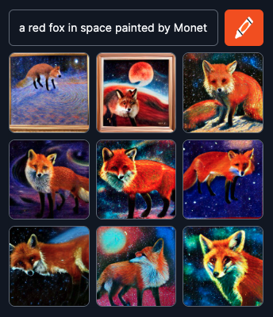
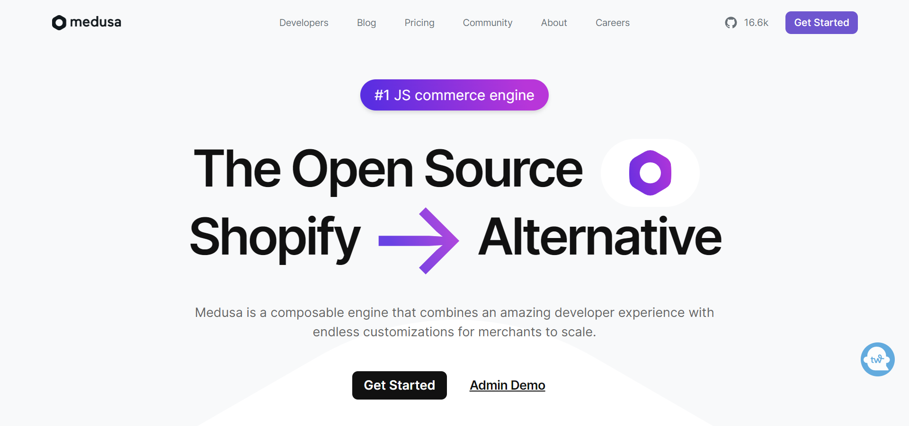
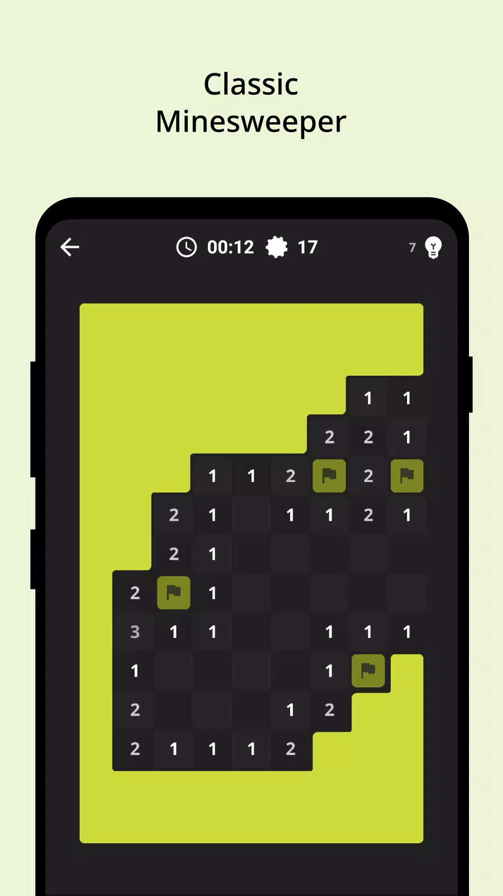
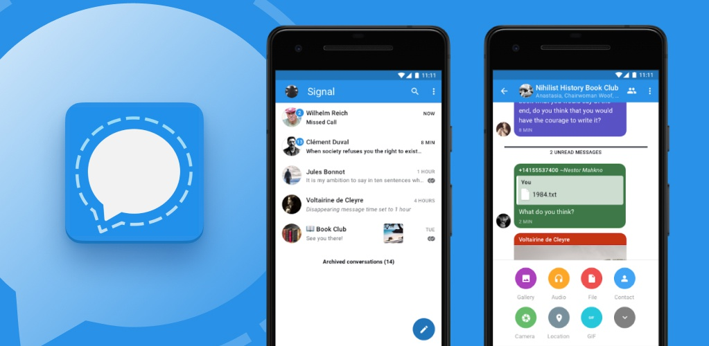

  

## Deep Learning Related Open Source Projects

## 1. [EasyOCR](https://github.com/JaidedAI/EasyOCR)

  

### What is it?

* EasyOCR is an open-source OCR (Optical Character Recognition). An OCR is the electronic or mechanical conversion of images of typed, handwritten or printed text into machine-encoded text. 

 

### What does it solve?

* EasyOCR aims to simplify the integration and usage of OCR technology in Python applications. It provides an easy-to-use interface for extracting text from images, making it accessible for developers without extensive knowledge of OCR algorithms or complex configurations.
* With EasyOCR, you can extract text from images, scanned documents, or screenshots using a simple API. The library takes care of the underlying OCR processes, including image preprocessing, character segmentation, and recognition, allowing developers to focus on utilizing the extracted text in their applications. 

 

### What technologies are involved in building it?

1. EasyOCR is mainly build using Python.
2. It uses deep learning frameworks like torch
3. It implements OCR algorithms and uses pretrained models
4. It also uses Open CV (Open Source Computer Vision Library) which is used for image manipulation, preprocessing, and feature extraction. 

 

### Why am I interested in it?
	
* EasyOCR supports over 80 languages, including popular ones like English, Spanish, Chinese, French, and many more. However it doesn’t include support for Amharic -- a language spoken mainly in Ethiopia and Eritrea and has around 60 million native and second language speakers. Amharic has its own unique script (Ethiopic -- the only one in Africa)  and I would like to request for and help with the implementation of Amharic text recognition using EasyOCR [guide](https://github.com/JaidedAI/EasyOCR#guideline-for-new-language-request) 

   

## 2. [Dalle-Mini]( https://github.com/borisdayma/dalle-mini) 

 

 

### What is it?

DALL·E Mini refers to a smaller, open source, version of the DALL·E model, which is an advanced language-to-image synthesis model developed by OpenAI. DALL·E Mini is a variant that offers a reduced model size and computational requirements compared to the full-scale DALL·E model while retaining some of its capabilities. 

 

### What does it solve? 

Given a textual description, DALL·E Mini is used for generating contextually relevant images (see [Craiyon]( https://www.craiyon.com/)). Compared to DALL·E, the reduced size of DALL·E Mini makes it more computationally efficient and accessible to developers and researchers. 

 

### What technologies are involved in building it?

DALL·E Mini makes use of the following deep leaning tools:

1. generative adversarial networks (GANs) or transformer-based architectures
2. PyTorch
3. NLP libraries like Hugging Face's Transformers or spaCy 

 

### Why am I interested in it?

I am interested because I it is a resource that I have used multiple times in the past and I have always wondered how such generative deep learning models actually work. I would like to contribute to the project by recommending bug-fixes and improvements! 

   

******************************************************************************************************************

## Web Development Related Open Source Projects

## 3. [Medusa]( https://github.com/medusajs/medusa) 

 

 

### What is it? 

Medusa is a set of commerce modules and tools that can be used to build rich, reliable, and performant commerce applications. All modules are open-source and freely available on npm. 

 

### What does it solve? 

Medusa provides modules that allows users to easily build commerce applications without reinventing core commerce logic. The modules can be customized and used to build advanced ecommerce stores, marketplaces, or any product that needs foundational commerce primitives. 

 

### What technologies are involved in building it?

Medusa is mainly build using 

1. TypeScript and 
2. JavaScript 

 

### Why am I interested in it?

My interest in this open-source project is two-fold:

1.	Working on this project will help me better understand how to work with JavaScript projects (I am a beginner “JavaScriptor” :) )
2.	 To help me familiarize myself with web development and obtain some transferrable skills by helping report bugs and suggesting improvements in different areas 

   

******************************************************************************************************************

## Android Development Related Open Source Projects

## 4. [AntiMine-Android]( https://github.com/lucasnlm/antimine-android) 

 

 

### What is it?

Antimine is a minesweeper-like puzzle game. The objective is to flag the spaces with mines to make the field a safer place without exploding any of them. You win the game when you've flagged every mine in the minefield. But be careful not to trigger one! 

 

### What does it solve? 

Gives easy access to the world-renowned puzzle game through an beautifully designed android app! 

 

### What technologies are involved in building it?

Main programming languages used are 

1. Kotlin (~90%)
2. A dash of C++

 

### Why am I interested in it?
	
By contributing to this app, I hope to improve two of the skills I learned from my classes during my study abroad semester at AIT-Budapest
1. Android Application Development using Kotlin and 
2. UI/UX skills (it has a very clean design I really like) 

 

## 5. [Signal-Android]( https://github.com/signalapp/Signal-Android) 

 

 

#### What is it?

Signal is a secure messaging app for Android (and other platforms) that prioritizes privacy and end-to-end encryption. 

 

### What does it solve? 

Signal is known for its strong security measures and commitment to protecting user data. 

 

### What technologies are involved in building it?

Signal uses the following tools:

1. Java - used for building the app itself
2. Android SDK - provides a set of tools, libraries, and APIs specific to Android app development
3. WebRTC (Web Real-Time Communication) – facilitating encrypted audio and video transmission
4. Signal Protocol - protocol for ensuring end-to-end encryption for secure messaging and calls 
5. Firebase - used for providing features like push notification

 

### Why am I interested in it?

I would like to contribute to the signal app because I want to learn more about

* end-to-end encryption 
* firebase integration 

both of which will come in handy if I want to create an android app that stores and sends information over the internet.

  

******************************************************************************************************************

### Other Open Source Projects of Interest:- [Lawnchair-2]( https://github.com/LawnchairLauncher/lawnchair) 

